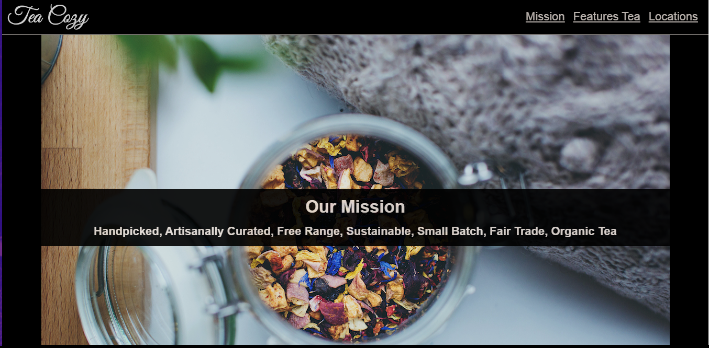

# Website of The Tea Cozy

This real-word project was dedicated to create a responsive website of a tea shop.
I built this project as part of the CodeCademy course. 

You can see the website here: https://carolincode.github.io/project-responsive-tea-cozy/

